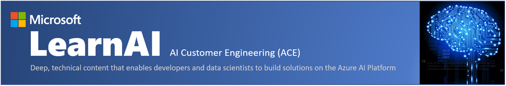

# Apps & Agents

## Cognitive Services Bootcamp - Build an Intelligent Search Solution for Images using Microsoft AI Platform

## About this course

In this course, you will focus on hands-on activities that develop proficiency in Azure Cognitive Services including Computer Vision, Custom Vision, LUIS, and Bing Search. 
You will also learn to leverage other AI-oriented services such as Azure Search and Azure Bot Services. 
These labs assume an introductory to intermediate knowledge of these services, and, if this is not the case, then you should spend the time working through the prerequisites.

This training is two days long, but you can compress the content with [alternative agendas](./alternative-agendas/one-day-deltas.md).

> **!!Important note 09/28/2018!!**: The Microsoft Bot Builder SDK V4 went GA at Ignite this week. The bot labs have been updated to SDK V4, but the SDK V3 labs are located in the resources folder for the bot labs (not being maintained). Additionally, we have moved the logging and testing labs to supplementary exercises (not being maintained at the moment), and the bootcamp will focus on the addition of the Bing Search APIs to bots and other applications.  
> If you are an instructor redelivering this course and have questions, please email learnAI@microsoft.com.  

## Goals

Most challenges observed by customers in these realms are in stitching multiple services together. As such, where possible, we have tried to place key concepts in the context of a broader example.

At the end of this workshop, you should be able to:

- Understand how to configure your apps to call Cognitive Services
- Build an application that calls various Cognitive Services APIs (specifically Computer Vision)
- Effectively leverage the custom vision service to create image classification  and object detection services that can then be leveraged by an application
- Understand how to implement Azure Search features to provide a positive search experience inside applications
- Configure an Azure Search service to extend your data to enable full-text, language-aware search
- Build, train, and publish a LUIS model to help your bot communicate effectively
- Build and publish an intelligent bot using Microsoft Bot Framework that leverages LUIS and Azure Search
- Add Cognitive Services (specifically the Bing Search APIs) to your existing applications

## Prerequisites

This workshop is meant for an AI Developer on Azure. Since this is only a short workshop, there are certain things you need before you arrive.

Firstly, you should have some previous exposure to Visual Studio. We will be using it for everything we are building in the workshop, so you should be familiar with [how to use it](https://docs.microsoft.com/en-us/visualstudio/ide/visual-studio-ide) to create applications. Additionally, this is not a class where we teach you how to code or develop applications. We assume you have some familiarity with C# (intermediate level - you can learn [here](https://mva.microsoft.com/en-us/training-courses/c-fundamentals-for-absolute-beginners-16169?l=Lvld4EQIC_2706218949) and [here](https://docs.microsoft.com/en-us/dotnet/csharp/quick-starts/)), but you do not know how to implement solutions with Cognitive Services.

Secondly, you should have some experience developing bots with Microsoft's Bot Framework. We won't spend a lot of time discussing how to design them or how dialogs work. If you are not familiar with the Bot Framework, you should complete [this tutorial](https://docs.microsoft.com/en-us/azure/bot-service/dotnet/bot-builder-dotnet-sdk-quickstart?view=azure-bot-service-4.0) prior to attending the workshop.

Thirdly, you should have experience with the portal and be able to create resources (and spend money) on Azure. We will not be providing Azure passes for this workshop.

Finally, before arriving at the workshop, we expect you to have completed [1_Setup](./lab01.1-computer_vision/1_Setup.md) along with configuring the following for Custom Vision:

1. Training API Key: The training API key allows you to create, manage and train Custom Vision project programmatically

1. You can obtain a key by creating a new project at <https://customvision.ai> and then clicking on the “setting” gear in the top right

## Agenda

Please note: This is a rough agenda, and the schedule is subject to change pending class activities, breaks, and interactions.

- Day 1: Cognitive Services
  - 8-9 (optional): Setup assistance
  - 9-10: Introduction and Context for [Cognitive Services](http://www.azure.com/cognitive)
  - 10-12: [Lab 1.1: Simplifying Cognitive Services App Development using Portable Class Libraries](./lab01.1-computer_vision/0_README.md)
  - 12-1: Lunch
  - 1-1:30: Introduction to Custom Vision
  - 1:30-2: [Lab 1.2: Creating an Image Classification Application using the Custom Vision Service](./lab01.2_customvision01/0_README.md)
  - 2-2:30: [Lab 1.3: Creating an Object Detection Application using the Custom Vision Service](./lab01.3_customvision02/0_README.md)
  - 2:30-2:45: Break
  - 2:45-3:45: [Lab 1.5: Developing Intelligent Applications with LUIS](./lab01.5-luis/0_README.md)
  - 3:45-5: [Business Case I - Cognitive Services](./lab01.6-bootcamp_case_1/Case_Part1.md)
- Day 2: Bots
  - 9-10: [Lab 2.1: Developing Intelligent Applications with Azure Search](./lab02.1-azure_search/0_README.md)
  - 10-10:30: Introduction and Context for Bots
  - 10:30-12:30: [Lab 2.2: Building Intelligent Bots](./lab02.2-building_bots/0_README.md)
  - 12:30-1:30: Lunch
  - 1:30-3:  [Lab 2.3: Enhancing Applications with Bing Search](./lab02.3-bing_search/0_README.md)
  - 3-3:15: Break
  - 3:15-4:15: [Business Case II - Bots](./lab02.4-bootcamp_case_2/Case_Part2.md)
  - 4:15-5: Q&A and Feedback for Emerging AI Bootcamp

## Supplementary materials

The LearnAI team has provided some extra labs you may be interested in:

- [Lab 2.5: Log Chat Conversations in your Bot](./lab02.5-logging_chat_conversations/0_README.md)
- [Lab 2.6: Testing your Bot](./lab02.6-testing_bots/0_README.md)

## Related courses

Here are some related courses from the LearnAI team:

- [LearnAI: Intelligent Agents: Design and Architecture](https://aka.ms/daaia)
- [LearnAI: Building Enterprise Cognitive Search Solutions](https://aka.ms/kmb)  

## Contact

Contact us: learnAI@microsoft.com and <http://aka.ms/LearnAI-GitHub>

## Certifications

The LearnAI team had intense participation in the creation of the following new Microsoft certifications and its required tests:

+ [Azure Data Engineer​](https://www.microsoft.com/en-us/learning/azure-data-engineer.aspx)
  + DP-200: Implementing an Azure Data Solution
  + DP-201: Designing an Azure Data Solutions​

+ [Azure AI Engineer​](https://www.microsoft.com/en-us/learning/azure-ai-engineer.aspx)
  + AI-100: Designing and Implementing an Azure AI Solution

+ [Azure Data Scientist](https://www.microsoft.com/en-us/learning/azure-data-scientist.aspx)
  + DP-100: Designing and Implementing a Data Science Solution on Azure​

## Contributing

This project welcomes contributions and suggestions.  Most contributions require you to agree to a
Contributor License Agreement (CLA) declaring that you have the right to, and actually do, grant us
the rights to use your contribution. For details, visit <https://cla.microsoft.com.>

When you submit a pull request, a CLA-bot will automatically determine whether you need to provide
a CLA and decorate the PR appropriately (e.g., label, comment). Simply follow the instructions
provided by the bot. You will only need to do this once across all repos using our CLA.

This project has adopted the [Microsoft Open Source Code of Conduct](https://opensource.microsoft.com/codeofconduct/).
For more information see the [Code of Conduct FAQ](https://opensource.microsoft.com/codeofconduct/faq/) or
contact [opencode@microsoft.com](mailto:opencode@microsoft.com) with any additional questions or comments.
