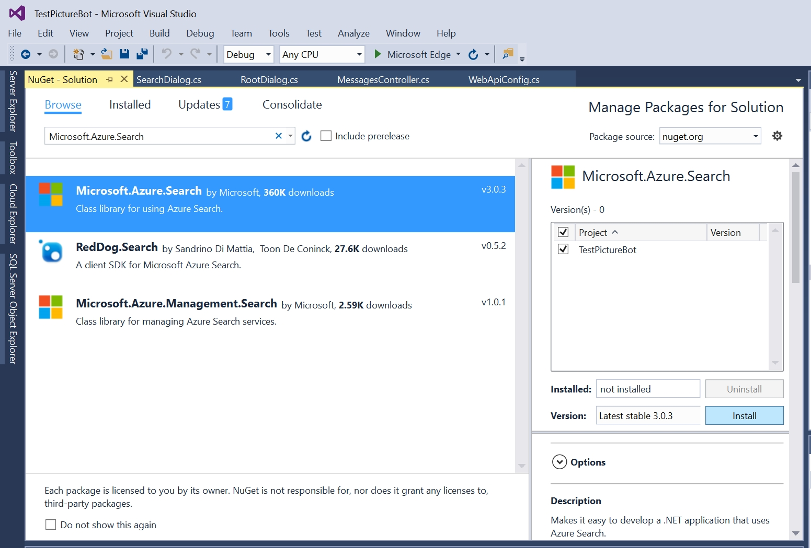

# 2_Azure_Search

Estimated Time: 10-15 minutes

We now have a bot that can communicate with us if we use very specific words. The next thing we need to do is set up a connection to the Azure Search index we created in "lab02.1-azure_search."

## Lab 2.1: Update the bot to use Azure Search

First, we need to update "SearchDialog" to request a search and process the response. We'll have to call Azure Search here, so make sure you've added the NuGet package (you should have done this in an earlier lab, but here's a friendly reminder).



Open "PictureBot.cs" and locate `var search_waterfallsteps`. Here is where we'll add the names of the tasks we need to run through this dialog. For PictureBot, we'll have two steps: `SearchRequestAsync` and `SearchAsync`. Add them to the variable `search_waterfallsteps`.  

For `SearchRequestAsync`, you need to check if the user has told us what to search for. You can do this by accessing PictureState to see what `state.Searching` is set to. If the state is "no", then we need to change the state to "yes" and then prompt the user what they want to search for. You can read more about [using the dialog library to gather input here](https://docs.microsoft.com/en-us/azure/bot-service/bot-builder-prompts?view=azure-bot-service-4.0&tabs=csharp). Review the following code, then add it below `// Add SearchDialog-related tasks`:

```csharp
        private async Task<DialogTurnResult> SearchRequestAsync(WaterfallStepContext stepContext, CancellationToken cancellationToken)
        {
            // Check if a user has already started searching, and if you know what to search for
            var state = await _accessors.PictureState.GetAsync(stepContext.Context);

            // If they're just starting to search for photos
            if (state.Searching == "no")
            {
                // Update the searching state
                state.Searching = "yes";
                // Save the new state into the conversation state.
                await _accessors.ConversationState.SaveChangesAsync(stepContext.Context);

                // Prompt the user for what they want to search for.
                // Instead of using SearchResponses.ReplyWithSearchRequest,
                // we're experimenting with using text prompts
                return await stepContext.PromptAsync("searchPrompt", new PromptOptions { Prompt = MessageFactory.Text("What would you like to search for?") }, cancellationToken);
            }
            else // This means they just told us what they want to search for
                // Go to the next step in the dialog, which is "SearchAsync"
                return await stepContext.NextAsync();
        }
```

In the second step for SearchDialog, we will process the user's search request and return the results. Add the following below the `SearchRequestAsync` task:

```csharp
        private async Task<DialogTurnResult> SearchAsync(WaterfallStepContext stepContext, CancellationToken cancellationToken)
        {
            // Add state so we can update it throughout the turn
            var state = await _accessors.PictureState.GetAsync(stepContext.Context);
            // If we haven't stored what they want to search for
            if (state.Search == "")
            {
                // Store it and update the ConversationState
                state.Search = (string)stepContext.Result;
                await _accessors.ConversationState.SaveChangesAsync(stepContext.Context);
            }
            var searchText = state.Search;
            // Confirm with the user what you're searching for
            await SearchResponses.ReplyWithSearchConfirmation(stepContext.Context, searchText);
            // Process the search request and send the results to the user
            await StartAsync(stepContext.Context, searchText);

            // Clear out Search or future searches, set the searching state to no,
            // update the conversation state
            state.Search = "";
            state.Searching = "no";
            await _accessors.ConversationState.SaveChangesAsync(stepContext.Context);

            return await stepContext.EndDialogAsync();
        }
```

Review the code line-by-line with a neighbor and confirm you both follow what is happening.  

You should be able to see that we're taking in the response from the user, confirming with the user what we're searching for, and waiting for the results of the StartAsync method before ending the dialog. Note that you're getting an error for `StartAsync`, can you figure out why?  

We're getting an error for `StartAsync` simply because we haven't created it yet. We need this task (along with some tasks we'll build into it) to accomplish several things in order to process the user's search:  

1. Establish a connection to the search service
2. Call the search service and store the results
3. Put the results in a message and respond to the user

Discuss with a neighbor which methods below accomplish which tasks above, and how:

```csharp
        public async Task StartAsync(ITurnContext context, string searchText)
        {
            ISearchIndexClient indexClientForQueries = CreateSearchIndexClient();
            // For more examples of calling search with SearchParameters, see
            // https://github.com/Azure-Samples/search-dotnet-getting-started/blob/master/DotNetHowTo/DotNetHowTo/Program.cs.  
            // Call the search service and store the results
            DocumentSearchResult results = await indexClientForQueries.Documents.SearchAsync(searchText);
            await SendResultsAsync(context, searchText, results);
        }

        public async Task SendResultsAsync(ITurnContext context, string searchText, DocumentSearchResult results)
        {
            IMessageActivity activity = context.Activity.CreateReply();
            // if the search returns no results
            if (results.Results.Count == 0)
            {
                await SearchResponses.ReplyWithNoResults(context, searchText);
            }
            else // this means there was at least one hit for the search
            {
                // create the response with the result(s) and send to the user
                SearchHitStyler searchHitStyler = new SearchHitStyler();
                searchHitStyler.Apply(
                    ref activity,
                    "Here are the results that I found:",
                    results.Results.Select(r => ImageMapper.ToSearchHit(r)).ToList().AsReadOnly());

                await context.SendActivityAsync(activity);
            }
        }

        public ISearchIndexClient CreateSearchIndexClient()
        {
            // Configure the search service and establish a connection, call it in StartAsync()
            // replace "YourSearchServiceName" and "YourSearchServiceKey" with your search service values
            string searchServiceName = "YourSearchServiceName";
            string queryApiKey = "YourSearchServiceKey";
            string indexName = "images";
            // if you named your index "images" as instructed, you do not need to change this value

            SearchIndexClient indexClient = new SearchIndexClient(searchServiceName, indexName, new SearchCredentials(queryApiKey));
            return indexClient;
        }
```

Now that you understand which piece does what and why, add the code below the comment `// Lab 2.2.2 Add search related tasks`.  

Set the value for the "YourSearchServiceName" to be the name of the Azure Search Service that you created earlier.  If needed, go back and look this up in the [Azure portal](https://portal.azure.com).  

Set the value for the "YourSearchServiceKey" to be the key for this service.  This can be found in the [Azure portal](https://portal.azure.com) under the Keys section for your Azure Search.  In the below screenshot, the SearchServiceName would be "aiimmersionsearch" and the SearchServiceKey would be "375...".  


Finally, the SearchIndexName should be "images," but you may want to confirm that this is what you named your index in the Azure Search lab.  

Press F5 to run your bot again.  In the Bot Emulator, try searching for something like "dogs" or "water".  Ensure that you are seeing results when tags from your pictures are requested.  

You might notice that if you run the bot, and immediately try to search for pictures, you are greeted instead. Why is that? Hint: review the `MainDialog` tasks in PictureBot.cs.

You might also notice that if you run the bot, greet the bot, and then submit "dogs", you get the `ReplyWithConfused` result. Why is that? What is the state after you've been greeted and before you submit "dogs"? Your code isn't (necessarily) wrong, you're just not triggering the flow as you set it up. Review your dialog set and what makes you move from one dialog to the next. Ask a neighbor if you get stuck.  

If you struggled with either (or both) of the above comments, you probably are feeling that this bot is not very smart. It's not understanding what you're trying to do, even though (you feel like) you're being clear. In the next lab, we'll address this frustration, so it is valuable for you to experience it.

Get stuck? You can find the solution for this lab under **resources > code**. We recommend using this as a reference, not as a solution to run, but if you choose to run it, be sure to add the necessary keys. The readme file within the solution (once you open it) will tell you what keys you need to add in order to run the solution.

### Continue to [3_LUIS](./3_LUIS.md)

Back to [README](./0_README.md)
