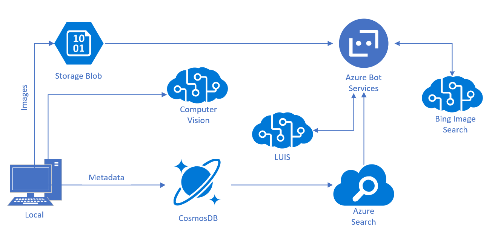

# Overview

Estimated Time: 15-20 minutes

## Introduction and Motivation

## Looking back

In the previous labs, we built an end-to-end scenario that allows you to pull in your own pictures, use Cognitive Services to find objects and people in the images, create a description of the images, and store all of that data in CosmosDB. Then we used CosmosDB to populate an Azure Search index, and then build a Bot Framework bot using LUIS to allow easy, targeted querying.

## What next

As you know, once you deploy any application or process, it's never *really* complete. There are always additions. Sometimes development happens in phases. Sometimes the requirements change. Well, a bot is just a type of an application, so the same idea applies here.  

Let's say, for the purposes of this scenario, you want to enhance PictureBot. Now, due to the title of this section, you may have already inferred what is coming next. However, take a few minutes to brainstorm with a neighbor some ways you might be able to make PictureBot better.  

...  
...  
...  

OK, welcome back! Hopefully, produced some good ideas for future enhancements. Feel free to try implementing them **later**. If you're looking to do more investigating around designing and architecting intelligent agents (and how to plan for enhancements), we recommend checking out this course: [Designing and Architecting Intelligent Agents](https://aka.ms/daaia).  

So you're probably wondering how we're going to use one of the Bing Search APIs (which are part of Azure Cognitive Services) to make our bot better. You may have noticed that some of your queries result in "There were no results for {insert search request}." You might have even noticed that sometimes, there are search hits, but not exactly what you were searching for. How can we address this to provide the users with a better experience?  

In this lab, we'll try to improve the user experience by giving users the option to also search the web to find images that match their search request after we've returned the results from our Azure Search service. We'll do this by calling the Bing Image Search API from within our bot application. After we've updated our bot, we'll republish it on Azure Bot Service.  

## Bing Search

Before we get into the lab, let's back up and talk about the Bing Search APIs. The Bing Search APIs add intelligent search to your app, combining hundreds of billions of webpages, images, videos, and news to provide relevant results with no ads.  

The Bing Search APIs fall into the "search" category of [Azure Cognitive Services](https://docs.microsoft.com/en-us/azure/cognitive-services/), and there are currently eight of them:  

* [Bing News Search](https://docs.microsoft.com/en-us/azure/cognitive-services/bing-news-search/search-the-web): Returns a list of news articles that Bing determines are relevant to a user's query
* [Bing Web Search](https://docs.microsoft.com/en-us/azure/cognitive-services/bing-web-search/overview): Returns similar results as Bing, can include web pages, images, videos, and more
* [Bing Video Search](https://docs.microsoft.com/en-us/azure/cognitive-services/Bing-Video-Search/search-the-web): Returns videos that Bing determines are relevant to a query
* [Bing Autosuggest](https://docs.microsoft.com/en-us/azure/cognitive-services/Bing-Autosuggest/get-suggested-search-terms): Lets you send a partial search query to Bing and get back a list of suggested queries that other users have search on. For example, as the user enters each character of their search term, you'd call this API and populate the search box's drop-down list with the suggested query strings.
* [Bing Entity Search](https://docs.microsoft.com/en-us/azure/cognitive-services/bing-entities-search/search-the-web): Returns information about entities that Bing determines are relevant, including entities (well-known people, places or things) and places (restaurants, hotels, local businesses).
* [Bing Image Search](https://docs.microsoft.com/en-us/azure/cognitive-services/bing-image-search/overview): Returns images that Bing determines are relevant to a user's query
* [Bing Visual Search](https://docs.microsoft.com/en-us/azure/cognitive-services/bing-visual-search/overview): Returns insights about an image such as visually similar images, shopping sources for products found in the image, and related searches. Here's a [blog post](https://azure.microsoft.com/en-us/blog/bing-visual-search-and-entity-search-apis-for-video-apps/) and [video](https://www.youtube.com/watch?time_continue=1&v=fj1BX2INbZE) to learn more.
* [Bing Custom Search](https://docs.microsoft.com/en-us/azure/cognitive-services/bing-custom-search/overview): Specify the domains, subsites, and webpages that Bing searches, customizing search experiences for different topics  

Take a few minutes to explore some the capabilities of the various service (each link should take you to more information about the service). Discuss with your neighbor at least one thing you learned that the Bing Search APIs can do that you did not know.  

## Lab options  

Depending on your previous experience and your experience in this workshop, you might (hopefully) be feeling more comfortable and confident with Cognitive Services and the Bot Framework. For this last lab, you have two options:

1. Continue to the [next page](./2_Bing_Search.md) to receive step-by-step instructions, resources, etc. (just as in previous labs).
2. Do not open the next file. Instead, try integrating Bing Image Search API to your bot without assistance. If you choose this option, you should understand that you **will not receive debugging assistance** from the instructor. You can peek at the solution file (under **resources > code**) or the [next page](./2_Bing_Search.md) for ideas.  

### Continue to [2_Bing_Search](./2_Bing_Search.md)

Return to [0_README](0_README.md)