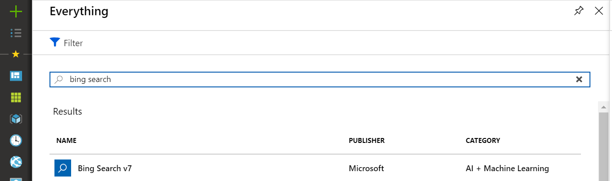
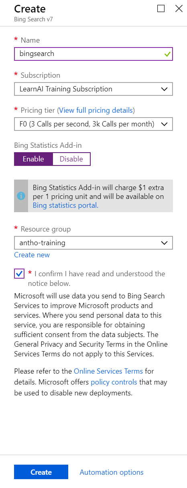

# 2_Bing_Search

Estimated Time: 45-60 minutes

Now that you have an overview of the various services that are available around search, you will implement just one of the services, to see how it might be done. The same API key can be used to access all services and they are called in similar ways, so once you can add Bing Image Search to your applications, calling other Bing Search APIs *should* be fairly straightforward.  

This lab has four parts:  

1. Create a Bing Search service
2. Update `SearchResponses`
3. Update `SearchDialog` to call Bing Image Search
4. (optional) Republish your bot

## Lab 2.1: Create a Bing Image Search service

Within the Azure Portal, click **Create a resource**, enter "bing search" in the search bar, and click **Bing Search v7->Create**.



Once you click this, you'll have to fill out a few fields as you see fit. For this lab, the "F0" free tier is sufficient. You are only able to have one Free Bing Search instance per subscription, so if you or another member on your subscription have already done this, you will need to use the "S1" pricing tier. Use the same resource group as previous labs. You can enable [Bing Statistics](https://www.bingapistatistics.com/) if you want, but we won't be exploring it in this lab. Click Create.  

  

Once creation is complete, open the panel for your new Bing Search service, find the key, and store it with your list of keys.  

### Lab 2.2: Update your responses and prompts

Before you update the dialog and the calls to Bing Search, you need to prep some messages that the bot will send to the user. The general idea is after you return the results from Azure Search, you'll give users a choice to search Bing as well. Depending on their response, you'll either confirm their search and return the results or end the dialog so they can make new searches or other requests.  

Open your PictureBot.sln in Visual Studio and navigate to "PictureBot.cs". The first thing is to ask the user if they want to view the web results from Bing.  

Recall, in "lab02.2-building_bots", you used [prompts from the dialog library](https://docs.microsoft.com/en-us/azure/bot-service/bot-builder-prompts?view=azure-bot-service-4.0&tabs=csharp) to ask the user what they want to search for. If you don't remember, review your `SearchDialog`.  

In this lab, we'll explore using prompting with suggested actions (`ChoicePrompt`) instead of just text. Suggested actions basically allow users to click (or tap depending on device) quick replies using buttons, without having to type out a full response. There are different arguments for using suggested actions vs [cards](https://docs.microsoft.com/en-us/azure/bot-service/bot-builder-howto-add-media-attachments?view=azure-bot-service-4.0&tabs=csharp#send-a-hero-card), but a key difference is with a suggested action, after the user makes a selection, the buttons go away and with cards they don't. This makes it so later on in the conversation, the user can't select a button that is no longer relevant to the current conversation.  

> We recommend reading more about [suggested actions](https://docs.microsoft.com/en-us/azure/bot-service/bot-builder-howto-add-suggested-actions?view=azure-bot-service-4.0&tabs=csharp), [prompts](https://docs.microsoft.com/en-us/azure/bot-service/bot-builder-prompts?view=azure-bot-service-4.0&tabs=csharp), and [other media](https://docs.microsoft.com/en-us/azure/bot-service/bot-builder-howto-add-media-attachments?view=azure-bot-service-4.0&tabs=csharp).  

Now, add an additional waterfall step (call it `SearchBingAsync`) to your `search_waterfallsteps`. This is ultimately where we'll call Bing and return the results.  

Next, since you'll be using an additional prompt, below `_dialogs.Add(new TextPrompt("searchPrompt"));` you'll need to add your Bing prompt that you'll use to ask the user if they'd also like to get the web results from Bing. Add the following:

```csharp
_dialogs.Add(new ChoicePrompt("bingPrompt"));
```

Create a shell for `SearchBingAsync` below your `SearchAsync` task by adding the following:

```csharp
        private async Task<DialogTurnResult> SearchBingAsync(WaterfallStepContext stepContext, CancellationToken cancellationToken)
        {
            throw new NotImplementedException();
        }
```

Next, navigate to your `SearchAsync` task. At the end, you should notice that you reset the search and the searching parameters. Well, you don't want to do that if you might be calling Bing Search. You'll need to wait to end the dialog and clear the state until after the user has either told you they don't want to search Bing, or you've called Bing and gotten the results. This is what you'll do in `SearchBingAsync`, so cut the following code from `SearchAsync` and paste it into `SearchBingAsync` (and remove the `throw new NotImplementedException();` from `SearchBingAsync`).

```csharp
            // Clear out Search or future searches, set the searching state to no,
            // update the conversation state
            state.Search = "";
            state.Searching = "no";
            await _accessors.ConversationState.SaveChangesAsync(stepContext.Context);

            return await stepContext.EndDialogAsync();
```

> You can ignore the errors around `state` for now.  

Instead of clearing the search and ending the dialog in `SearchAsync`, which you've now removed, you want to prompt the user and update `state.Searching` to `bing` as an indicator that you've prompted them and are awaiting a response.  

Below `await StartAsync(stepContext.Context, searchText);` in the `SearchAsync` task, review and add the following:

```csharp
            // Check if they want to search Bing
            if (state.Searching == "yes")
            {
                // update the searching state to "bing"
                state.Searching = "bing";
                await _accessors.ConversationState.SaveChangesAsync(stepContext.Context);
                return await stepContext.PromptAsync("bingPrompt", new PromptOptions
                {
                    Prompt = MessageFactory.Text("Would you like to view the web results from Bing?"),
                    Choices = ChoiceFactory.ToChoices(new List<string> { "Yes", "No" }),

                },
                cancellationToken);
            }
            else // This means they just told us if they want to search Bing or not
            {
                // Go to the next step in the dialog, which is "SearchBingAsync"
                return await stepContext.NextAsync();
            }
```

You may get an error around `ChoiceFactory` and `List<string>`. Can you fix it?
> Hint: `ChoiceFactory` is located within `Microsoft.Bot.Builder.Dialogs.Choices` and the ability to use lists comes from `System.Collections.Generic`.

Now, before we get any further in building `SearchBingAsync`, you need to add a few responses to "SearchResponses.cs". Navigate to the file and create three new responses:

1. `ReplyWithBingConfirmation` that tells the user you are searching Bing with what they wanted to search for.
2. `ReplyWithBingResults` which you'll send to the user once you get the results, basically saying here are the **top five** results for what you searched for.
3. `ReplyWithDontBing` which you'll send to the user if they choose not to search Bing (e.g. "OK, I won't search Bing.")

> Hint: The responses for 1 and 2 are similar in structure to `ReplyWithSearchConfirmation`.  

If you get stuck, you can peek at the solution under **resources > code**.

### Lab 2.3: Update `SearchBingAsync`

Now that you've got your responses ready, you can update `SearchBingAsync` to make a search to Bing if they respond yes to your prompt, and then return the top five results from Bing in a message.  

Open "PictureBot.cs" and locate where you created `SearchBingAsync`. It should look like this:

```csharp
        private async Task<DialogTurnResult> SearchBingAsync(WaterfallStepContext stepContext, CancellationToken cancellationToken)
        {
            // Clear out Search for future searches, set the searching state to no,
            // update the conversation state
            state.Search = "";
            state.Searching = "no";
            await _accessors.ConversationState.SaveChangesAsync(stepContext.Context);

            return await stepContext.EndDialogAsync();
        }
```

Before we perform the steps to clear out the state and end the dialog (what the code currently in `SearchBingAsync` does), we need to get the state, find out what they want to search for, and if they told us to search Bing, call Bing and return the results. In `SearchBingAsync`, we want to accomplish the following four steps before updating the state and ending the dialog, which is step five. Add this code to `SearchBingAsync` in order **above** the line `// Clear out Search for future searches, set the searching state to no,`:

1. Get the PictureState

```csharp
            // Add state so we can update it throughout the turn
            var state = await _accessors.PictureState.GetAsync(stepContext.Context);
```

1. Store `state.Search` in a local variable, `searchText` so we know what the user is searching for

```csharp
            var searchText = state.Search;
```

1. Store the user's answer to the ChoicePrompt in a variable `searchbing`

```csharp
            var searchbing = (string)stepContext.Result;
```

1. Based on the user's answer, potentially wait for the results from Bing

```csharp
            switch (searchbing)
            {
                case "Yes":
                    await SearchResponses.ReplyWithBingConfirmation(stepContext.Context, searchText);
                    // add Bing Search
                    await SearchBing(stepContext.Context, searchText);
                    break;
                case "No":
                    // End the dialog and wait for a response
                    await SearchResponses.ReplyWithDontBing(stepContext.Context);
                    break;
                default:
                    await MainResponses.ReplyWithConfused(stepContext.Context);
                    await MainResponses.ReplyWithHelp(stepContext.Context);
                    break;
            }
```

1. Only now can we update the state and end the dialog, which is what your starter code did. So there is no action from you for this step, except to confirm that at the end of `SearchBingAsync`, your code updates the conversation state and ends the dialog.  

At this point, you should have only one error, around `SearchBing`, because you haven't created it yet. The goal of `SearchBing` is to make the call out to the Bing Image Search API and return the results. We'll do that next.

### Lab 2.4 Calling the Bing Image Search API

You've now got everything ready for Bing Image Search. The only thing that's left is to actually make the call and return the results in a message to the user.  

The first step is to add the `Microsoft.Azure.CognitiveServices.Search.ImageSearch` NuGet package to your project. Do that now.  

Since you'll only call Bing from within "PictureBot.cs", you'll only need to add the following `using` statements to that file:

```csharp
using Microsoft.Azure.CognitiveServices.Search.ImageSearch;
using Microsoft.Azure.CognitiveServices.Search.ImageSearch.Models;
```

Next, below the task `SearchBingAsync`, create a new task with the following shell:

```csharp
        // Add SearchBing
        public async Task SearchBing(ITurnContext context, string searchText)
        {
            // Step 1: Call the Bing Image Search API

            // Step 2: Process the results and send to the user

        }
```

You can see there are two steps to sending the results from Bing to the user: calling the API and processing the results.

#### Step 1: Call the Bing Image Search API

In order to call the Cognitive Services APIs, there are a few things you have to do, regardless of which API. You need to:

1. Provide a key to the service.
2. Initialize the client for said service with your key.
3. Create a location to store the results.
4. Call the API and store the results in predetermined location.  

Review the follow code to confirm you understand the steps, then add the code below `// Step 1: Call the Bing Image Search API`.

```csharp
            //IMPORTANT: replace this variable with your Cognitive Services subscription key.
            string subscriptionKey = "YourBingKey";
            //initialize the client
            var client = new ImageSearchClient(new ApiKeyServiceClientCredentials(subscriptionKey));
            //images to be returned by the Bing Image Search API
            Images imageResults = null;
            try
            {
                // Call the API and store the results
                imageResults = client.Images.SearchAsync(query: searchText).Result; //search query
            }
            catch (Exception ex)
            {
                // If there's an exception, return the error in the chat window
                await context.SendActivityAsync("Encountered exception. " + ex.Message);
            }
```

Don't forget to replace "YourBingKey" with your Bing key!  

#### Step 2: Process the results and send to the user

This next block of code should remind you of when you called the Azure Search service and processed the results. Instead of using our models and creating a carousel of Hero cards, we're going to explore another method - simple attachments. [Spend a few minutes reviewing different ways of adding media to messages](https://docs.microsoft.com/en-us/azure/bot-service/bot-builder-howto-add-media-attachments?view=azure-bot-service-4.0&tabs=csharp).  

After reviewing the above reference, the implementation should be straightforward. If we get results from the service, let's grab the first five image results and store them in `activity` using `MessageFactory.Attachment()`. Then, let's tell the user here are the top five results for what they searched for and send the `activity` attachment. Review the code and then add it below `// Step 2: Process the results and send to the user`.

```csharp
            // If the API returns images
            if (imageResults != null)
            {
                // Parse out the first five images from ImageResults
                // Add the content URL to a simple message attachment
                var activity = MessageFactory.Attachment(new Attachment[]
                {
                    new Attachment { ContentUrl = imageResults.Value[0].ContentUrl, ContentType = "image/png" },
                    new Attachment { ContentUrl = imageResults.Value[1].ContentUrl, ContentType = "image/png" },
                    new Attachment { ContentUrl = imageResults.Value[2].ContentUrl, ContentType = "image/png" },
                    new Attachment { ContentUrl = imageResults.Value[3].ContentUrl, ContentType = "image/png" },
                    new Attachment { ContentUrl = imageResults.Value[4].ContentUrl, ContentType = "image/png" }
                });
                // Send the activity to the user.
                await SearchResponses.ReplyWithBingResults(context, searchText);
                await context.SendActivityAsync(activity);
            }
            else // If the API doesn't return any images
            {
                await SearchResponses.ReplyWithNoResults(context, searchText);
            }
```

You're now ready to run the bot. Test it in the 'development' endpoint in the Emulator to confirm it is working as expected. Then, by applying what you learned in the previous labs, re-publish the bot to your existing service, and test it in the 'production' endpoint. You should now also be able to interact with your enhanced bot in the portal via WebChat.

**Looking for a Challenge?**  

This bot allows you to search for pictures, and, in theory, share them with other people. In the real world, there are different license types for images, depending on what your intended usage is. Can you configure PictureBot to only return images from Bing of license type "Public" so the legal department doesn't come after you?  

These resources may help: [Resource 1](https://docs.microsoft.com/en-us/rest/api/cognitiveservices/bing-images-api-v7-reference#license) and [Resource 2](http://help.bing.microsoft.com/#apex/18/en-us/10006/0)

### More resources for Bing Search APIs

- [Bing Search .NET Samples](https://github.com/Azure-Samples/cognitive-services-dotnet-sdk-samples/tree/master/BingSearchv7)
- [Bing Web Search app Tutorial](https://docs.microsoft.com/en-us/azure/cognitive-services/bing-web-search/tutorial-bing-web-search-single-page-app)
- [ConferenceBuddy bot application that uses Bing Search and other Cognitive Services](https://github.com/Azure/ConferenceBuddy)