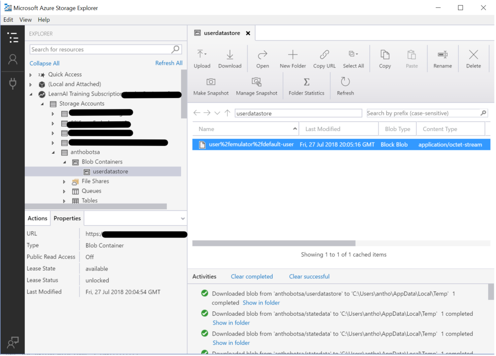

### Module 2.5

## 2_Azure:
Estimated Time: 15-20 minutes

## Logging data to Azure Storage Accounts

We've seen how to select messages and store the in temporary files. Perhaps we want to store them somewhere else, that's more accessible in a non-testing environment. In this lab, we'll set up an Azure storage account and route our data to be stored there.  

### Lab 2.1: Setup  

There are a few things we need to configure before we connect our PictureBot to Azure Storage:  

1. Install and authenticate to [Azure Storage Explorer](https://azure.microsoft.com/en-us/features/storage-explorer/) (note: if you're using the DSVM, it is already installed). Azure Storage Explorer is a great tool that allows you to manage storage anywhere from Windows/macOS/Linux. You can follow [this QuickStart through "Connect to an Azure subscription"](https://docs.microsoft.com/en-us/azure/vs-azure-tools-storage-manage-with-storage-explorer?toc=%2Fazure%2Fstorage%2Fqueues%2Ftoc.json&tabs=windows) if you don't already have it set up.  
2. Create an Azure Storage account (general purpose). You can [follow these instructions](https://docs.microsoft.com/en-us/azure/storage/common/storage-quickstart-create-account?tabs=portal#create-a-general-purpose-storage-account) if you need guidance. You could alternatively use the storage account you created in lab01.1. Be sure to store the connection string somewhere, as you will need it shortly.
3. Add the `Microsoft.Bot.Builder.Azure` NuGet package to your PictureBot solution. We will use some of the libraries here to connect to Azure and our storage account. **Make sure you check the "include prerelease" box to get the latest version.**  

### Lab 2.2: Log Utterances to an Azure Storage Account  

Now that we've got our environment configured, it's very easy for us to set up the connection.  

There are not many steps for us to change our data storage from temporary files to Azure Blob Storage.  

First, you'll need to add `using Microsoft.Bot.Builder.Azure;` to your using statements in your Startup class. This allows us to access the NuGet package we added in Lab 2.1.  

The last thing we need to do is connect our PictureBot to the service we created. There are two pieces of the Startup class that we have to modify.  

First, we need to connect to storage, but, for the purposes of this lab, we are going to focus on the UserData. So we will replace:  
```csharp
IStorage dataStore = new FileStorage(System.IO.Path.GetTempPath());
```
with:  
```csharp
IStorage conversationDataStore = new MemoryStorage();
IStorage userDataStore = new AzureBlobStorage("YourConnectionStringHere", "userdatastore");
```
Be sure to replace `"YourConnectionStringHere"` with your Azure storage account connection string.  

What we're doing is separating the store for UserState and ConversationState, and we are just using in-memory storage for ConversationState (since it is not of interest to us in this lab). We then link our `userDataStore` to the output of our UserData.  

The very last thing you need to do is update your `middleware.Add` lines that refer to state to the updated data stores.  

**If you get stuck, you can find the solution code under resources > code.**

Run the bot and have a sample/typical conversation within the emulator. Stop the bot and navigate to your storage account in **Azure Storage Explorer**. You should be able to locate the new Blob Container and entry.  



> Note: you may have to refresh your storage for new items/entries to appear. You can do this for the blob container by right-clicking on it and hitting "Refresh." You can refresh the contents of a specific blob container by hitting the "Refresh" icon (near the top-middle-right in the image above).

Review the items in the file (by downloading or double-clicking to open). Play around with interacting with the bot more, and observing the results in the file.  

Now, this is great, we can store the list of all the utterances that we're receiving. We can also use similar methodology to perform things like selective logging or logging answers only to specific questions.  

But what if we not only want to see what utterances users are sending, but also how the bot replies? How can we log both the message and the reply?  

### Continue to [3_Cosmos](./3_Cosmos.md), or return to the [Main](../../README.md) menu
