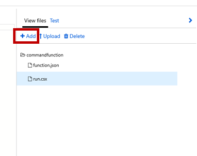

# Command and Control IoT Devices using Conversational AI

This hands-on lab guides you through one particular approach to cloud-to-device (C2D) messaging called Direct Method.  Azure IoT Hub provides several mechanisms for securely communicating with Edge devices all while not having any direct in-bound connectivity.

## Prerequisites

- Module 1 of the Azure IoT Labs
- A working bot :)

## Add a Function for Communicating with Io Hub

Click on **Create a resource**


Click on **Compute**, then...


Name your function, keep the other settings as you see below and click **Create**


Click the **+** next to Functions, then click on **In-portal** and click **Continue**


Click the **More templates...**, then click on **Finish and view templates**


Click on **HTTP trigger**, name it whatever you like, and select **Anonymous** under Authorization level.  Click **Create**


Click on **View files** on the right, and add a file named **function.proj**.  This file will add the required Nuget packages.



Add the following to **function.proj**

```
<Project Sdk="Microsoft.NET.Sdk">
    <PropertyGroup>
        <TargetFramework>netstandard2.0</TargetFramework>
    </PropertyGroup>
    
    <ItemGroup>
        <PackageReference Include="Microsoft.Azure.Devices" Version="1.17.3" />
    </ItemGroup>
</Project>
```

Click on the file called **run.csx**, and add the following text replacing [YOUR_IOTHUB_CONNECTIONSTRING] with the one found in the IoT Hub landing page under **Shared access policies -> iothubowner**.  Also replace [YOUR_DEVICE_NAME] with the MXChip device name in IoT Hub.

```
#r "Newtonsoft.Json"

using System.Net;
using Microsoft.AspNetCore.Mvc;
using Microsoft.Extensions.Primitives;
using Newtonsoft.Json;
using Microsoft.Azure.Devices;

static readonly string connectionString = "[YOUR_IOTHUB_CONNECTIONSTRING]";
static readonly string deviceName = "[YOUR_DEVICE_NAME]";
static dynamic serviceClient = ServiceClient.CreateFromConnectionString(connectionString);

public static async Task<IActionResult> Run(HttpRequest req, ILogger log)
{
    switch (req.Query["action"])
    {
        case "stop":
            await CallDeviceMethod("stop", log);
            break;
        case "start":
            await CallDeviceMethod("start", log);
            break;
    }

    return new OkResult();
}

private static async Task CallDeviceMethod(string methodName, ILogger log)
{
    var deviceMethod = new CloudToDeviceMethod(methodName, TimeSpan.FromSeconds(30));
    deviceMethod.SetPayloadJson("{}");
    await serviceClient.InvokeDeviceMethodAsync(deviceName, deviceMethod);
    log.LogInformation($"{methodName} method issued.");
}
```

Next, click on **</>Get function URL** and save for later.


## Update Language Understanding

In module 1.5, you created a LUIS model for your Bot.  We are now going to add the Intents and Entities needed for command and control.

In LUIS (luis.ai) click on **Entities**, and then click on **Create new entity**.  Type in **command**, leave the Entity Type as **Simple**, and hit **Done**


Now click on **Intents**, Type in **ControlDevice**, and hit **Done**


Enter in a few **utterances** such as 'stop the sensor' and 'start the sensor', then tag each sentence with the appropriate **Entity** as such...


Hit **Train**, and **Publish**

Return to the Visual Studio project for your Bot.  Open the file called **MainResponses.cs**, and add a new method...

```
public static async Task ReplyWithCommandComplete(string startstop, ITurnContext context)
    {
        await context.SendActivityAsync($"Your device command [{startstop}] is on its way!  Might already be done.");
    }
```

Now open the file called **PictureBot.cs**.  Add a using statement for **System.Net.Http** at the top.

Next search for a method called **MainMenuAsync** (appox. line 162).  We want to add our new intent to the list of available intents.  Immediate after the case statement for **Search Pics**, add the following code replacing [YOUR_FUNCTION_URL] with the Function URL you obtained earlier...

```
case "ControlDevice":
    var controlEntity = result?.Entities;
    var controlObj = JObject.Parse(JsonConvert.SerializeObject(controlEntity)).SelectToken("command");
    if (controlObj != null)
    {
        var client = new HttpClient();
        var startstop = controlObj.ToString().Replace("\"", "").Trim(']', '[').Trim();
        var botUrl = "[YOUR_FUNCTION_URL]?action=" + startstop;
        
        var response = await client.SendAsync(new HttpRequestMessage(HttpMethod.Post, botUrl));
        await MainResponses.ReplyWithCommandComplete(startstop, stepContext.Context);
    }
    else
    {
        await MainResponses.ReplyWithConfused(stepContext.Context);
    }
    break;
```

##Test Your Bot

Run your Bot back through the emulator and test out the new commands.

As an example, typing "stop the sensor" in your Bot will cause the blue LED on the MXChip to stop flashing, and all corresponding atmospheric data to cease transmission.