# Introduction to Azure IoT Hub

Azure IoT Hub is a fully managed service that enables reliable and secure bidirectional communications between millions of IoT devices and a solution back end. Azure IoT Hub:

* Provides multiple device-to-cloud and 
* cloud-to-device communication options. These options include one-way messaging, file transfer, and request-reply methods.
* Provides built-in declarative message routing to other Azure services.
* Provides a queryable store for device metadata and synchronized state information.
* Enables secure communications and access control using per-device security keys or X.509 certificates.
* Provides extensive monitoring for device connectivity and device identity management events.
* Includes device libraries for the most popular languages and platforms.

## IoTHub: Connect, monitor, and manage billions of IoT assets

* **Establish** bi-directional communication with billions of IoT devices
* **Authenticate** per device for security-enhanced IoT solutions
* **Register** devices at scale with IoT Hub Device Provisioning Service
* **Manage** your IoT devices at scale with device management
* **Extend** the power of the cloud to your edge device

<iframe src="https://channel9.msdn.com/Shows/Azure-Friday/Azure-IoT-Hub/player" width="480" height="270" allowFullScreen frameBorder="0"></iframe>

### In this lab you will

* Learn to Create IoT Hub

* Learn to use Simulator to connect to IoT Hub and send Data

* Learn to setup MXChip, connect to IoT Hub and send data

## Create Resource Group

The infrastructure for your application is typically made up of many components – maybe a virtual machine, storage account, and virtual network, or a web app, database, database server, and 3rd party services. 

You do not see these components as separate entities, instead you see them as related and interdependent parts of a single entity. You want to deploy, manage, and monitor them as a group. Azure Resource Manager enables you to work with the resources in your solution as a group. You can deploy, update, or delete all the resources for your solution in a single, coordinated operation. 

You use a template for deployment and that template can work for different environments such as testing, staging, and production. Resource Manager provides security, auditing, and tagging features to help you manage your resources after deployment. 

Create a resource group to collect and manage all your application resources for this lab

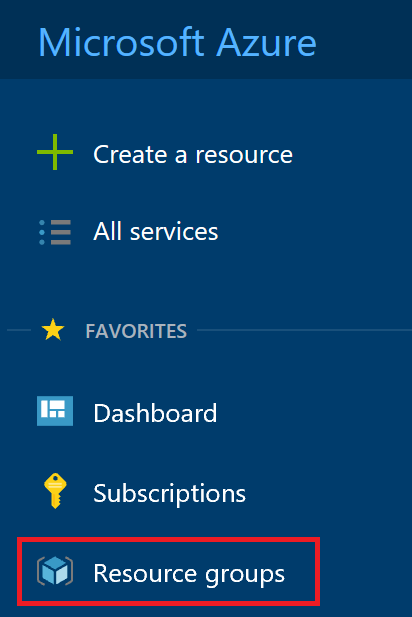

Click on **+ Add** button

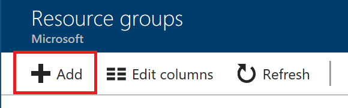

Enter **Resource group name**,  Select **subscription** and **region**

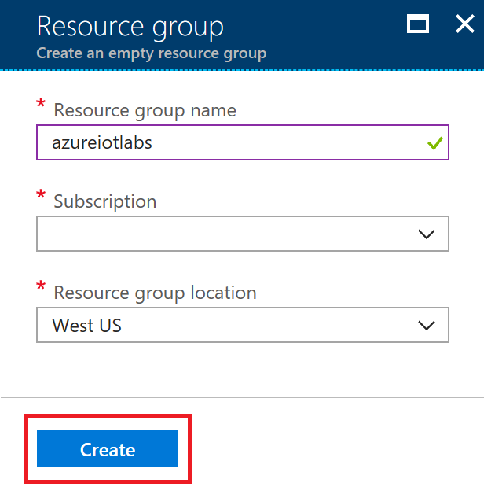

## Create IoThub

Create an IoT Hub to connect your real device or simulator to this IoTHub and start sending data.

Click on **Create a resource** and click on **Internet of Things**

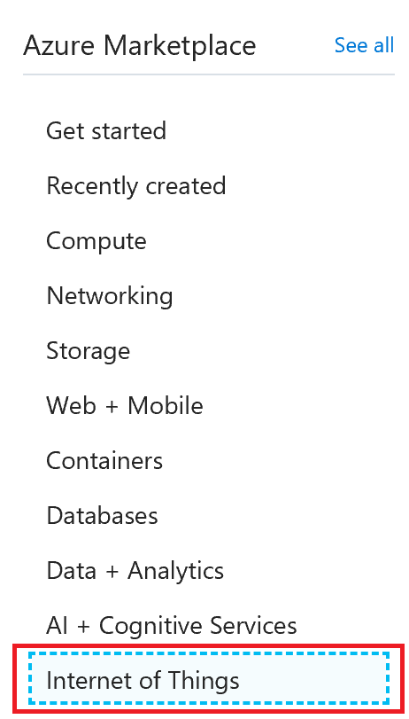

Click on **IoTHub**

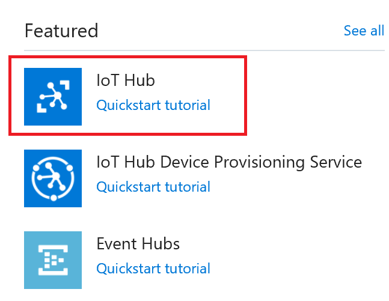

Make sure you select the resource group you created in previous step. 

In the Name field, enter a unique name for your IoT hub. The name of your IoT hub must be **unique** across all IoT hubs.

In the Tier filed, select **S1 tier**.

You can choose from several tiers depending on how many features you want and how many messages you send through your solution per day. The free tier is intended for testing and evaluation. It allows 500 devices to be connected to the IoT hub and up to 8,000 messages per day. Each Azure subscription can create one IoT Hub in the free tier.

The **S1** tier allows total of 400,000 messages per unit per day.

For details about the other tier options, see [Choosing the right IoT Hub tier](https://azure.microsoft.com/en-us/pricing/details/iot-hub/).

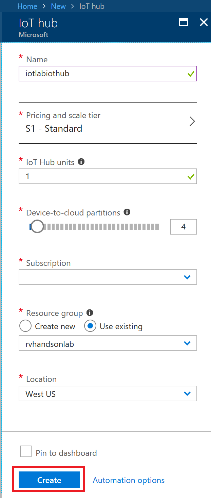

## Configure IoT Hub to Archive Messages

Azure Storage will give us a flexible, performant storage location to house the original messages for further analysis and/or data verification.  Let's get started...

## Create Azure Storage Account

Create Azure Storage account to store the exported IoTHub messages.

Click on **Create a resource**

Click on **Storage**, then...

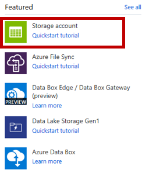

Be sure to place to storage account in the **same Location** as the IoTHub you created in the earlier lab.  Choose **Locally-redundant storage (LRS)** and click Create

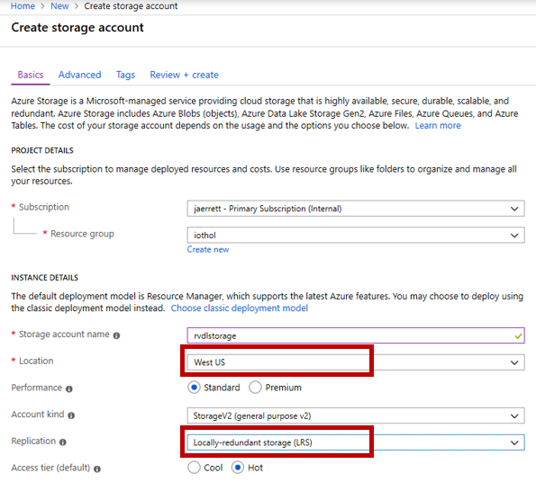

After the Storage Account is created, go to the main landing page for the storage, and click on **Blobs**

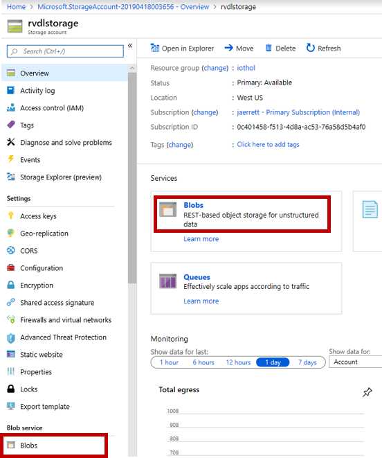

Click on **+ Container**, specify the container name, and hit **OK**

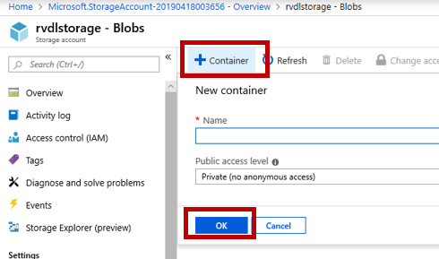

## Configure IoT Hub to Export Incoming Data

Go to the landing page for IoT Hub and click on **Message routing**

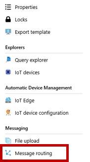

Click on **Custom endpoints**, then **+ Add**, then choose **Blob storage**

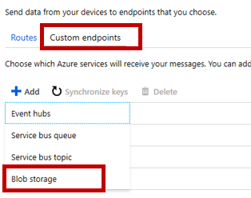

Specify any name, then click **Pick a container** and choose the storage account you created in the prior step.  Leave the other defaults, and click Create

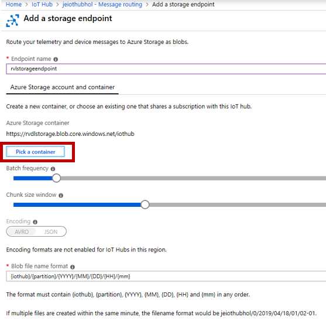

Click on **Routes**, and **+ Add**

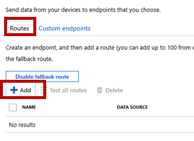

Specify a name for the route, choose your storage account endpoint, and a data source of Device Telemetry Messages.

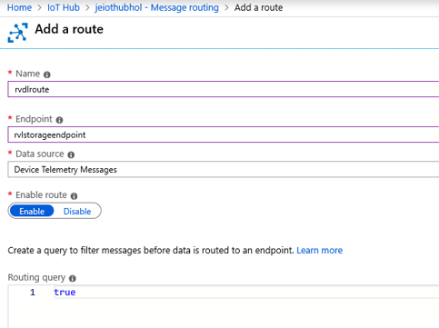

Now, we need to add a second route.  This route will make sure that all data landing in Azure Storage (as above), is also visible on the built-in endpoint called **events**.  Without this, all data will go to Azure storage (Routing query = true), and nothing will be available to other consumers. 

Click on **Routes**, and **+ Add** (again)

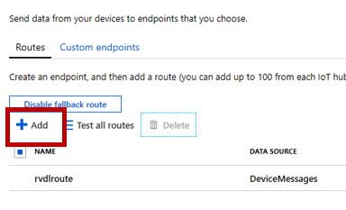

Specify a name for the route, choose the **events** endpoint, and a data source of Device Telemetry Messages.  Leave the rest as default, and click **Save**.

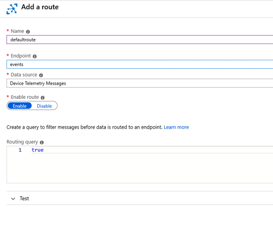

## Connect Device and Send Data to IoThub

This Lab assumes you are using MXChip as the Device

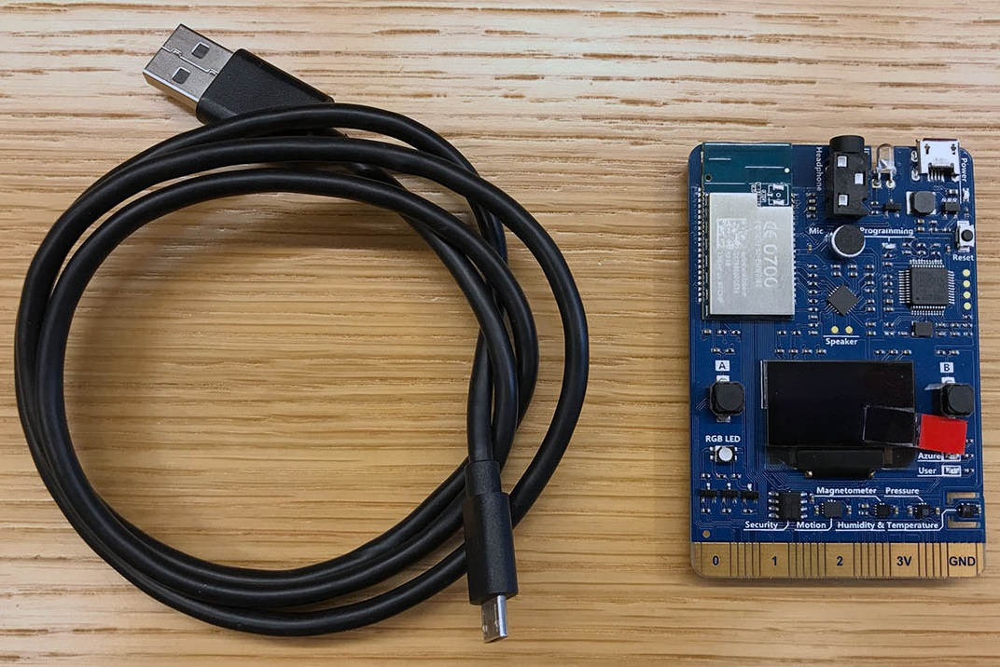

### Prepare the MXChip by 

* updating firmware
* connecting to Wifi
* connecting to Azure to select a subscription and IoTHub
* uploading device code

***Note:*** in the next Azure Docs lab ("Prepare MXChip to Connect to IoTHub"), it is stated that the json settings are under a menu labeled **open settings.json**.  However, in later versions of VSCode, the option was moved into the upper-level menu.

**Old menu**
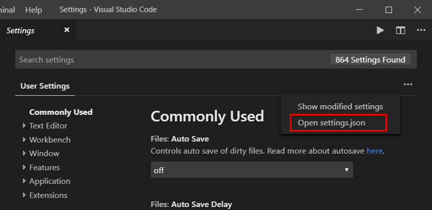

**New menu**
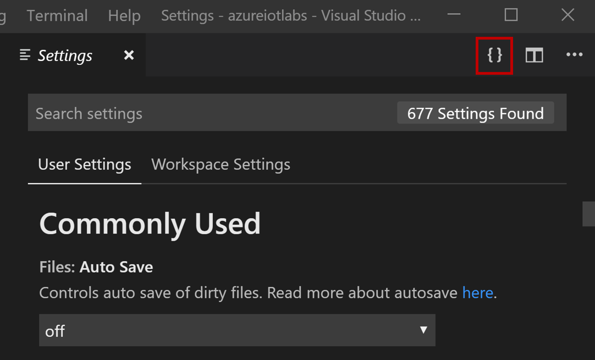

Right-click the link below and open the Azure Docs lab in a new window

: [Prepare MXChip to Connect to IoTHub](https://docs.microsoft.com/en-us/azure/iot-hub/iot-hub-arduino-iot-devkit-az3166-get-started)

Once Device Connects to IoTHub, messages flow into IoThub, and into your Azure Storage account.

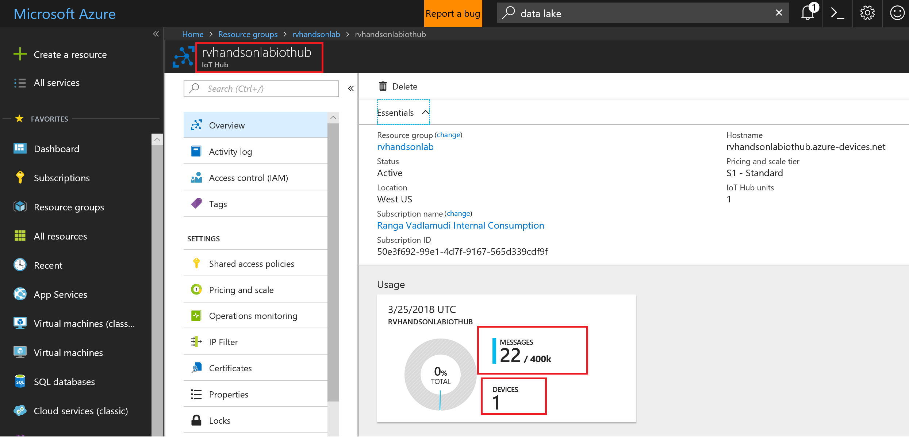

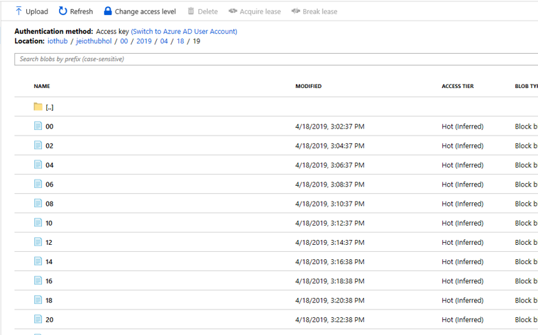

### Continue to [Module 2: Connect Pi Simulator to IoT Hub](../IoTHub-PiSimulator/README.md), or return to the [Main](../README.md) menu
