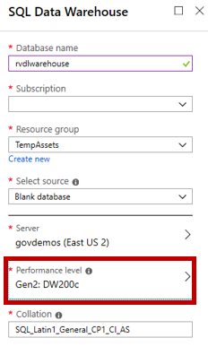

# Batch Analytics

## Batch Analytics with SQL Data Warehouse and Data Factory

SQL Data Warehouse is a cloud-based Enterprise Data Warehouse (EDW) that leverages Massively Parallel Processing (MPP) to quickly run complex queries across petabytes of data. Use SQL Data Warehouse as a key component of a big data solution. Import big data into SQL Data Warehouse with simple PolyBase T-SQL queries, and then use the power of MPP to run high-performance analytics. As you integrate and analyze, the data warehouse will become the single version of truth your business can count on for insights.

Azure Data Factory is a cloud-based data integration service that allows you to create data-driven workflows in the cloud for orchestrating and automating data movement and data transformation. Using Azure Data Factory, you can create and schedule data-driven workflows (called pipelines) that can ingest data from disparate data stores. It can process and transform the data by using compute services such as Azure HDInsight Hadoop, Spark, Azure Data Lake Analytics, and Azure Machine Learning.

In this lab Learn how to 

* automatically export data coming into Azure IoT Hub for archival.
* how to create an ingestion pipeline using Azure Data Factory, and
* how to use Data Warehouse to run big data analysis jobs that scale to massive data sets using familar tools.

## Create Azure SQL Data Warehouse Service

Create Data Lake Analytics service to mine data stored in Data Lake Store.

Click on **Create a resource**


Click on **Databases**


Click on **SQL Data Warehouse**


Create a new logical SQL Server which will act as the front end for your data warehouse.  Note: Record the Server name, admin, and passoword for later.


Since our intention is to showcase capabilities rather than performance, choose DW200c as the Performance Level



Use existing resource group and click on Create button

## Create Datawarehouse Objects

The next thing we will need to do is create the tables necessary for importing the IoT Telemetry.  Connect to you Data Science VM, and launch SQL Server Management Studio.


Select **SQL Server Authentication**, and use the credentials you recorded earlier.  If you need the **Server name**, it can be found on the portal page for the database created ealier.


Click on **Connect**.  Note: If you receive a error indicating that you cannot connec to the sql server, check the SQL Server Firewall for you Data Science VM's external IP address.


Click on **New Query**

Copy the the following script into the Query window and click **Execute**

```
CREATE TABLE [dbo].[fact_Telemetry]
(
	[messageId] int NULL,
	[deviceId] varchar(50) NULL,
	[temperature] numeric(10,5) NULL,
	[humidity] numeric(10,5) NULL,
	[EventProcessedUtcTime] varchar(50) NULL,
	[PartitionId] int NULL,
	[EventEnqueuedUtcTime] varchar(50) NULL,
	[time] varchar(50) NULL,
	[IoTHub.MessageId] varchar(50) NULL,
	[IoTHub.CorrelationId] varchar(50) NULL,
	[IoTHub.ConnectionDeviceId] varchar(50) NULL,
	[IoTHub.ConnectionDeviceGenerationId] varchar(50) NULL,
	[IoTHub.EnqueuedTime] varchar(50) NULL,
	[IoTHub.StreamId] varchar(50) NULL
)
WITH
(
	DISTRIBUTION = HASH ( [deviceId] ),
	CLUSTERED COLUMNSTORE INDEX
)
```

[SQL Create Table Script](https://github.com/kenhausman/azureiotlabs/blob/master/SQLDataWarehouse/scripts/SQLDW_Create_Telemetry_Table.sql)


## Create Azure Data Factory Service

Create Data Factory service to ingest data into Data Warehouse.

Click on **Create a resource**


Click on **Integration**, then...


Simply name the Data Factory resource, use existing resource group and click on Create button


On the landing page for your Data Factory, click on **Author & Monitor**.


Click on **Copy Data**.


On the **Properties** page, specify the options below...


Click on **Create new connection**, and choose **Azure Data Lake Storage Gen1**.  Click **Continue**


Choose the Azure Data Lake service created in Module 5, and Click **Finish**


Now we need to give the **Managed Identity** for Azure Data Factory access to Data Lake.

Back in the portal, in the Data Factory landing page, click on **Properties**.  At the bottom, you will see the Managed Identity for ADF.  This means that ADF can be configured with permissions similar to a standard user account.


Now go to the landing page for your Azure Data Lake Store account.  Click on **Data explorer**, then click on **Access**


Click **+ Add**, **Select user or group**, then type in the name of you Data Factory service, and click **Select**.


Give the account all permissions, and be sure to select **This folder and all children**, then click **Ok**.  Note: Least priviledges access at a subfolder level is recommended.


Back in Data Factory, click on **Create new connection** (again), and choose **Azure SQL Data Warehouse**.  Click **Continue**


Choose the Azure SQL Data Warehouse created earlier and Click **Finish**


Now, under **Source data store**, click on the Data Lake connection, and click **Next**


For the input folder, click **Browse**, and select **workshop/streaming** then click **Choose**.

Under **File loading behavior**, choose **Incremental Load**.  Click **Next**


Under **File format settings**, choose **JSON format**.  Click **Next**


Now, under **Destination data store**, click on the Data Warehouse connection, and click **Next**


Choose the table name created earlier, and click **Next**


On the **Column mapping** screen, accept the defaults and click **Next**


Uncheck the boxes next to **Enable staging** and **Allow Polybase**, and click **Next**


Congratulations!  You've created your first pipeline.  Click **Finish**


Click on the **Monitor** button to see your Pipeline in action


Return to SSMS and query the fact_Telemetry table for new records.


### Continue to [Module 8: Load Test using Device Simulator](../DeviceSimulator/README.md), or return to the [Main](../README.md) menu