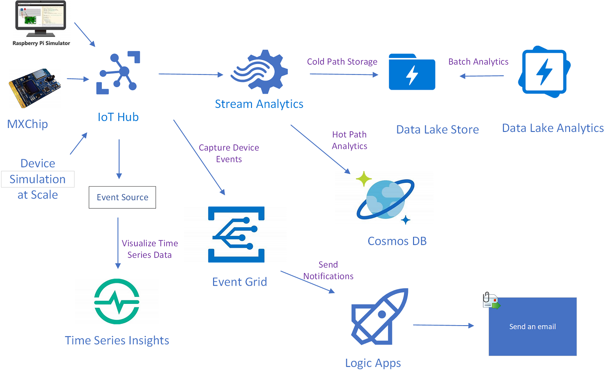
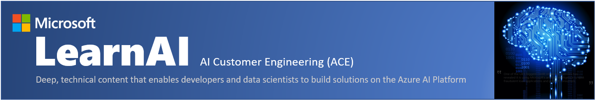

## Azure IoT & AI Workshop

The Azure IoT & AI Workshop is an accumulation of several resources available on Azure Docs giving you an introduction to Azure IoT sensor telemetry integration, and Artificial Intelligence services covering vision and natural language with bot services.

We will start by walking through the IoT Hands on Labs, then proceed to the AI portion of the workshop.  The final lab in the AI portion will bring both labs together while you implement IoT command-and-control functionality using natural language BoT processing.

Let's get started...

# Azure IoT Hands on Labs

Labs using Azure Services to build Azure IoT End to End Solutions connecting real & simulated devices to Azure IoT Hub.

## IoT Modules

### Setup: Azure subscription access and the Data Science Virtual Machine

**Duration**: 15-30 minutes

[Setup Lab](IoT_HOL/Setup/README.md)

### Module 1: Introduction to Azure IoT Hub and Connect MXChip

**Duration**: 60-90 minutes

[Azure IoTHub Lab with MXChip](IoT_HOL/IoTHub/README.md)

### Module 2: Connect Pi Simulator to IoT Hub

**Duration**: 30 minutes

[Azure IoTHub Pi Simulator Lab](IoT_HOL/IoTHub-PiSimulator/README.md)

### Module 3: Create Azure Time Series Insights and Visualize Device Data

**Duration**: 60 minutes

[Time Series Insights Lab](IoT_HOL/timeseriesinsights/README.md)

### Module 4: Capture Device Events and Send Notifications

**Duration**: 30 minutes

[Azure IoTHub with Event Grid Lab](IoT_HOL/EventGrid/README.md)

### Module 5: Cold Path Storage

**Duration**: 60-90 minutes

[Azure Date Lake Store Lab](IoT_HOL/DatalakeStore/README.md)

### Module 6: Hot Path Analytics

**Duration**: 60 minutes

[Cosmos DB Lab](IoT_HOL/CosmosDB/README.md)

### Module 7: Batch Analytics

**Duration**: 60 minutes

[SQL Data Warehouse Lab](IoT_HOL/SQLDataWarehouse/README.md)

### Module 8: Load Test using Device Simulator

**Duration**: 30 minutes

[Device Simulator](IoT_HOL/DeviceSimulator/README.md)

### Module 9: Configure and monitor IoT devices at scale

**Duration**: 30 minutes

[Automatic Device Configuration](IoT_HOL/automaticdeviceconfiguration/README.md)

Congratulations!  You have completed the IoT portion of this workshop.

# Azure Artificial Intelligence Hands on Labs

Labs using Azure Services to develop proficiency in Azure Cognitive Services including Computer Vision, Custom Vision, LUIS, and Bing Search. You will also learn to leverage other AI-oriented services such as Azure Search and Azure Bot Services. 

## AI Modules

### Module 1.1: Simplifying Cognitive Services App Development using Portable Class Libraries

**Duration**: 60 minutes

[Integrating Cognitive Services into VS Project](AI_HOL/lab01.1-computer_vision/0_README.md)

### Module 1.2: Creating an Image Classification Application using the Custom Vision Service

**Duration**: 30 minutes

[Build Custom Vision Model](AI_HOL/lab01.2_customvision01/0_README.md)

### Module 1.3: Creating an Object Detection Application using the Custom Vision Service

**Duration**: 30 minutes

[Object Detection with Custom Vision](AI_HOL/lab01.3_customvision02/0_README.md)

### Module 1.4: Developing Intelligent Applications with LUIS

**Duration**: 30 minutes

[Language Understanding Intelligent Service](AI_HOL/lab01.5-luis/0_README.md)

### Module 1.5: Business Case 1 - Cognitive Services

**Duration**: 60 minutes

[Cognitive Services Business Case Part 1](AI_HOL/lab01.6-bootcamp_case_1/Case_Part1.md)

#### Module 1 section complete!  Take a break and continue on to Module 2.

### Module 2.1: Developing Intelligent Applications with Azure Search

**Duration**: 60 minutes

[Integrate Azure Search](AI_HOL/lab02.1-azure_search/0_README.md)

### Module 2.2: Building Intelligent Bots

**Duration**: 60-90 minutes

[Working with BoT Framework](AI_HOL/lab02.2-building_bots/0_README.md)

### Module 2.3: Enhancing Applications with Bing Search

**Duration**: 60-90 minutes

[Integrating with a Public Search Engine](AI_HOL/lab02.3-bing_search/0_README.md)

### Module 2.4: Business Case 2 - Bots

**Duration**: 60 minutes

[BoT Services Business Case Part 2](AI_HOL/lab02.4-bootcamp_case_2/Case_Part2.md)

### Module 2.5: Logging with Microsoft Bot Framework

**Duration**: 60 minutes

[Conversation Logging](AI_HOL/lab02.5-logging_chat_conversations/0_README.md)

### Module 2.6: Testing Bots with Microsoft Bot Framework

**Duration**: 30 minutes

[Testing Bots](AI_HOL/lab02.6-testing_bots/0_README.md)

#### Congratulations! You have completed the Azure IoT & AI Workshop.

### Module 2.7: Command and Control IoT Devices using Conversational AI

**Duration**: 30 minutes

[IoT Command and Control](AI_HOL/lab02.7-mxchip_command_control/README.md)

Congratulations! You have completed the Azure IoT & AI Workshop.

# Supplementary Learning Materials

- [Microsoft Learn](https://docs.microsoft.com/en-us/learn/)
- [AI School](https://aischool.microsoft.com)
- [IoT School](https://iotschool.microsoft.com)
- [Microsoft Professional Certification Programs](https://www.edx.org/course/?type=Professional%20Certificate&school=Microsoft%3A%20Microsoft)
- [edX Azure courses](https://www.edx.org/course?search_query=Azure)

## Interesting GitHub resources
- [Intelligent Kiosk](https://github.com/Microsoft/Cognitive-Samples-IntelligentKiosk)
- [AI Toolkit for IoT Edge](https://github.com/Azure/ai-toolkit-iot-edge)
- [Spark ML Batch Scoring for Predictive Maintenance](https://github.com/Azure/BatchSparkScoringPredictiveMaintenance)
- [Azure Organization](https://github.com/Azure)
- [Microsoft Organization](https://github.com/Microsoft)

## Certifications

The LearnAI team had intense participation in the creation of the following new Microsoft certifications and its required tests:

+ [Azure Data Engineer​](https://www.microsoft.com/en-us/learning/azure-data-engineer.aspx)
  + DP-200: Implementing an Azure Data Solution
  + DP-201: Designing an Azure Data Solutions​

+ [Azure AI Engineer​](https://www.microsoft.com/en-us/learning/azure-ai-engineer.aspx)
  + AI-100: Designing and Implementing an Azure AI Solution

+ [Azure Data Scientist](https://www.microsoft.com/en-us/learning/azure-data-scientist.aspx)
  + DP-100: Designing and Implementing a Data Science Solution on Azure​

## Use of GitHub

We will be using GitHub for all of our labs and corresponding documentation for this workshop. To learn more about GitHub, please visit this brief tutorial:
+ [GitHub Tutorial](https://lab.github.com/githubtraining/paths/first-day-on-github)
